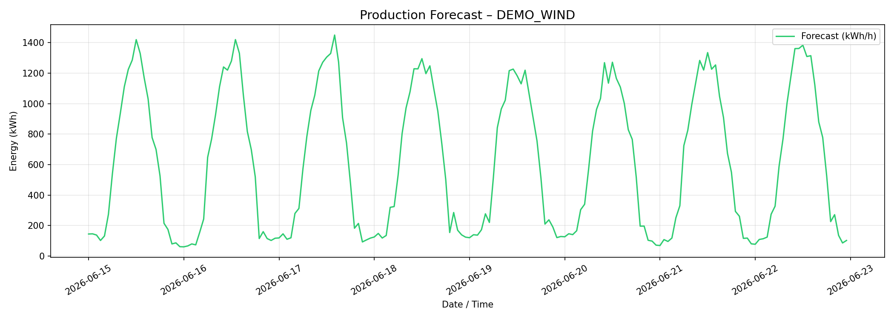

# EcoWatt – Renewable Energy Forecasting Engine

> ML-based day-ahead and intra-day production forecasting for wind and solar plants.  
> Built during a quantitative-analyst internship in the Italian energy trading sector (2025).

---

## Overview

EcoWatt is a Python forecasting engine that predicts the hourly energy output
of renewable power plants using gradient-boosting models trained on
meteorological NWP forecasts.  
The pipeline covers the full lifecycle: **data ingestion → feature engineering → training → inference → output**.



### Key features

| Feature | Detail |
|---|---|
| **ML models** | XGBoost (primary), LightGBM and CatBoost (ensemble exploration) |
| **Weather data** | [Open-Meteo](https://open-meteo.com/) – free, no API key required |
| **Feature engineering** | Wind shear exponent, theoretical power curve, turbulence proxy, solar geometry (cyclic encoding) |
| **Production data** | SQL database *or* CSV file (for demo / offline use) |
| **Validation** | Walk-forward split, MAE / RMSE / R² / sMAPE / nRMSE / bias |
| **Output** | CSV forecast + matplotlib PNG plot |
| **Scheduler** | Cron-style daemon for automated intra-day runs (00 / 03 / 06 / … / 21 h) |

---

## Architecture

```
ecowatt.py              ← main module (all logic)
demo.py                 ← self-contained demo with synthetic data
plants_config.json      ← plant registry
requirements.txt        ← Python dependencies
output/                 ← forecast CSVs and plots (generated at runtime)
```

**Pipeline flow:**

```
Open-Meteo API
      │
      ▼
 download_weather()          historical-forecast or forecast API
      │
      ▼
 feature_engineering()       shear, power-curve, cyclic time, rolling stats
      │
      ├──[train]──► train_xgboost()  →  model_{id}.xgb + scaler_{id}.pkl
      │
      └──[infer]──► model.predict()  →  output/forecast_{id}_{ts}.csv
                                         output/forecast_plot_{id}_{ts}.png
```

---

## Quickstart

### 1. Clone and install

```bash
git clone https://github.com/<your-username>/ecowatt-forecast.git
cd ecowatt-forecast
python -m venv .venv && source .venv/bin/activate
pip install -r requirements.txt
```

### 2. Run the demo (no database needed)

The demo generates one year of synthetic wind production data, trains a model,
and produces a 7-day forecast – entirely offline.

```bash
python demo.py
```

Results land in `output/`.

### 3. Real plant data via CSV

Provide a CSV with columns `Timestamp` (UTC, `YYYY-MM-DD HH:MM`) and `value` (kWh/h):

```bash
python ecowatt.py train \
  --plant_id WIND_PLANT_A \
  --lat 44.0 --lon 11.0 \
  --plant_type wind \
  --rated_power_kw 5000 \
  --start 2023-01-01 --end 2023-12-31 \
  --production_csv data/plant_a_production.csv

python ecowatt.py forecast \
  --plant_id WIND_PLANT_A \
  --lat 44.0 --lon 11.0 \
  --plant_type wind \
  --rated_power_kw 5000 \
  --days 7
```

### 4. Real plant data via database

Set the connection string as an environment variable before running
(never hard-code credentials):

```bash
export ECOWATT_DB_CONN_STR="DRIVER={ODBC Driver 17 for SQL Server};SERVER=<host>;DATABASE=<db>;UID=<user>;PWD=<pass>"
python ecowatt.py train --plant_id ... --production_csv ""   # omit --production_csv to use DB
```

> **Security note:** `ECOWATT_DB_CONN_STR` is read at runtime only.  
> It is listed in `.gitignore` patterns and should **never** be committed.

### 5. Automatic scheduling daemon

```bash
python ecowatt.py schedule
```

Runs forecasts for all plants in `plants_config.json` at 00:05, 03:05, 06:05,
09:05, 12:05, 15:05, 18:05, 21:05 local time (matching typical NWP update cycles).

---

## Plant configuration (`plants_config.json`)

```jsonc
[
  {
    "plant_id": "WIND_PLANT_A",      // unique identifier (used in file names)
    "lat": 44.0,                      // latitude (decimal degrees)
    "lon": 11.0,                      // longitude
    "plant_type": "wind",             // "wind" or "solar"
    "rated_power_kw": 5000,           // nameplate capacity (kW)
    "forecast_horizon_days": 7        // max look-ahead days
  }
]
```

---

## Feature engineering

### Wind plants

| Feature | Description |
|---|---|
| `wind_speed_80m` | Hub-height wind speed (m/s) |
| `theoretical_power` | Simplified cubic power curve output (kWh/15 min) |
| `wind_efficiency` | `v³ / v₉₅³` – normalised power density |
| `wind_regime` | Ordinal bin: 0=off / 1=low / 2=medium / 3=rated / 4=high / 5=extreme |
| `wind_dir_sin/cos` | Directional encoding (avoids 0°/360° discontinuity) |
| `wind_speed_ma3` | 3-step centred moving average (persistence proxy) |
| `wind_speed_std6` | 6-step rolling std (turbulence proxy) |
| `shear_exponent` | `α = log(v₈₀/v₁₀) / log(8)` – atmospheric stability indicator |
| `hour_sin/cos` | Cyclic hour-of-day encoding |
| `month_sin/cos` | Cyclic month-of-year encoding |
| `day_of_year_norm` | Fractional day of year [0, 1] |
| `temperature_2m` | 2-m air temperature (affects air density) |
| `surface_pressure` | Atmospheric pressure (affects air density) |
| `relative_humidity_2m` | Relative humidity |

### Solar plants

| Feature | Description |
|---|---|
| `shortwave_radiation` | Global horizontal irradiance (W/m²) |
| `direct_radiation` | Direct normal irradiance |
| `diffuse_radiation` | Diffuse horizontal irradiance |
| `temperature_2m` | Panel temperature proxy |
| `relative_humidity_2m` | Cloud / aerosol proxy |
| `hour_sin/cos` | Solar elevation proxy |
| `month_sin/cos`, `day_of_year_norm` | Seasonal encoding |

---

## Model details

### XGBoost regressor

- **Sample weighting:** production periods above 30% and 60% of nameplate are
  up-weighted (×3 and ×5 respectively) to reduce under-estimation bias at
  high-production regimes.
- **Hyperparameters:** `learning_rate=0.005`, `subsample=0.9`,
  `colsample_bytree=0.85`, `min_child_weight=100`, `gamma=0.1`,
  `reg_alpha=0.1`, `reg_lambda=0.5` – tuned empirically on wind plant data.
- **Early stopping:** 50 rounds on a 30-day walk-forward validation set.
- **Scaling:** `StandardScaler` applied before DMatrix construction.

### Validation strategy

A chronological (walk-forward) split is used: the validation window is either
the last 30 days of the training period or a user-specified date.
No random shuffling is applied to avoid leakage.

### Reported metrics

| Metric | Formula |
|---|---|
| MAE | `mean(|y - ŷ|)` |
| RMSE | `sqrt(mean((y - ŷ)²))` |
| nRMSE | `RMSE / (P_n × 0.25) × 100` |
| R² | Coefficient of determination |
| sMAPE | `mean(2|y-ŷ| / (|y|+|ŷ|)) × 100` |
| Bias | `mean(ŷ - y)` – positive = systematic over-forecast |

---

## Output format

`output/forecast_<plant_id>_<timestamp>.csv`:

```
Timestamp,forecast_kwh,plant_id
2026-06-15 00:00:00,1234.5,WIND_PLANT_A
2026-06-15 01:00:00,1456.2,WIND_PLANT_A
...
```

---

## Extending to additional models

The `ecowatt.py` module is structured so that `train_xgboost` can be swapped
for `LGBMRegressor` or `CatBoostRegressor` without changing the rest of the
pipeline.  A `StackingRegressor` (Ridge meta-learner over XGB + LGBM + CatBoost
base models) is supported by `scikit-learn` and can be plugged in at the
`train` function level.

---

## Security & credentials

- **No credentials are stored in this repository.**
- Database connection strings are read exclusively from the `ECOWATT_DB_CONN_STR`
  environment variable.
- Trained model artefacts (`*.xgb`, `*.pkl`) are excluded from version control
  via `.gitignore`.

---

## License

[CC BY-NC-ND 4.0](https://creativecommons.org/licenses/by-nc-nd/4.0/) – see `LICENSE` for details.  
You may share this work with attribution, but **not** for commercial purposes and **not** in modified form.
